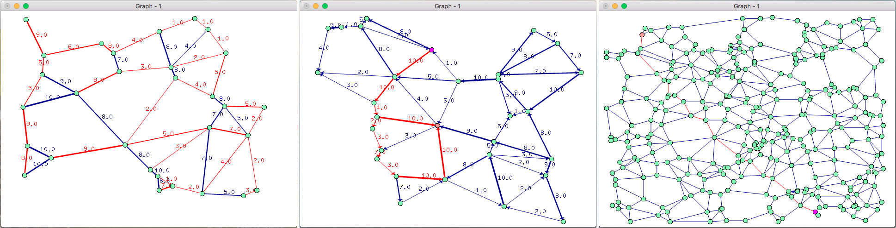

##### Project: Graph-Theory
##### Author: DEISS Olivier
##### Started: September 2015

This project is a toolbox for Graph Theory. It includes graph algorithms and an interface to visualize them, using OpengGL.

Language: C++ 
Libraries: OpenGL, Glut

-----------------------------------------------------------------------------------

From left to right: Prim, Ford-Fulkerson, A*

-----------------------------------------------------------------------------------

Keys (graph management):
 - '+': add more vertices
 - '-': remove vertices
 - '1': new graph
 - '2': create an oriented graph
 - '3': add weights to the edges
 - enter: dupplicate the graph
 - escape: delete the current graph
 - space: reset the current graph

Keys (algorithms): 
 - 'a': A*
 - 'd': Dijkstra
 - 'e': Edmonds-Karp
 - 'f': Ford-Fulkerson
 - 'p': Prim
 - 't': Traveling Salesman problem

