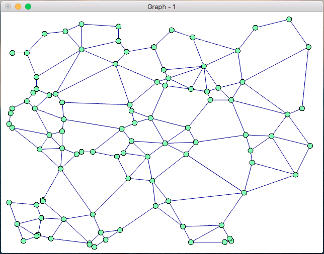
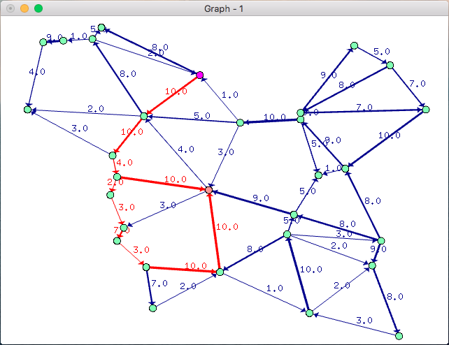
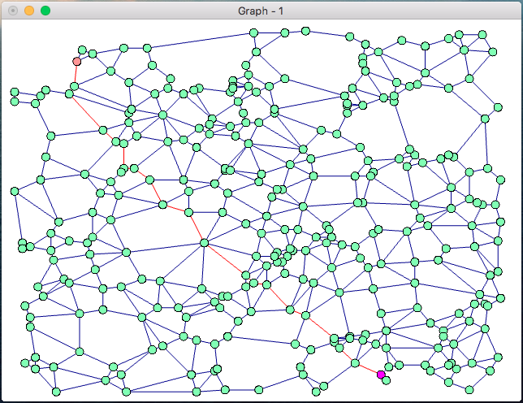

#### Project: Graph-Theory 
#### Author: DEISS Olivier 
#### Last update: 22/11/2015

This project is a toolbox for Graph Theory.

Language: C++ 
Libraries: OpenGL, Glut

-----------------------------------------------------------------------------------

Screenshots :

-----------------------------------------------------------------------------------

The project is only available for MacOS and Linux users.

Keys:
 - '+': add more vertices
 - '-': remove vertices
 - '1': new graph
 - '2': create an oriented graph
 - '3': add weights to the edges
 - 'd': dijkstra algorithm
 - 'f': ford-fulkerson algorithm
 - 'p': prim algorithm
 - enter: dupplicate the graph
 - escape: delete the current graph
 - space: reset the current graph

