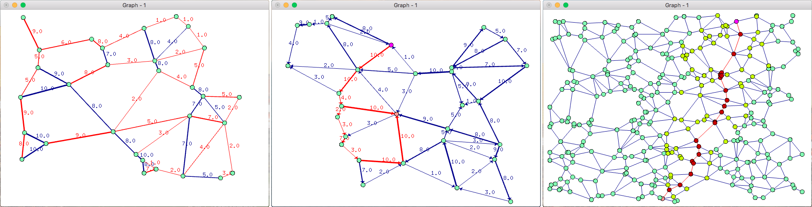

# Graphs

Graphs is a toolbox for Graph Theory written in C++ with OpenGL and glut. It includes graph algorithms and an interface to visualize them. The project works with Gabriel graphs: these graphs look like road maps and are therefore nice for the study of lots of Graph algorithms.

***

### Install

##### Linux

You need to have glut installed on your platform. You can install it with:

	apt-get install freeglut3 freeglut3-dev

Then running `make linux` will compile *Graphs* in *bin*. You can run `make clean` to delete the build directory.

##### Mac

You need to have XCode installed on your system. Then running `make mac` will compile *Graphs* in *bin*. You can run `make clean` to delete the build directory.

***

### Use

Call `bin/graphs` to launch the application. The keys are described below.

##### Graphs and Windows managements

* `+`: add more vertices
* `-`: remove vertices
* `1`: new graph
* `2`: create an oriented graph
* `3`: add weights to the edges
* `enter`: dupplicate the graph
* `escape`: delete the current graph
* `space`: reset the current graph

##### Algorithms

* `a`: A* (shortest path)
* `b`: Bron-Kerbosch (maximal clique)
* `d`: Dijkstra (shortest path)
* `e`: Edmonds-Karp (maximum flow)
* `f`: Ford-Fulkerson (maximum flow)
* `p`: Prim (minimum spanning tree)
* `t`: Traveling Salesman (shortest route)

***

### License

Graphs - Copyright (C) 2016 -  Olivier Deiss

This program is free software: you can redistribute it and/or modify
it under the terms of the GNU General Public License as published by
the Free Software Foundation, either version 3 of the License, or
(at your option) any later version.

This program is distributed in the hope that it will be useful,
but WITHOUT ANY WARRANTY; without even the implied warranty of
MERCHANTABILITY or FITNESS FOR A PARTICULAR PURPOSE.  See the
GNU General Public License for more details.

You should have received [a copy of the GNU General Public License](COPYING)
along with this program. If not, see <http://www.gnu.org/licenses/>.

***

### Contact

olivier . deiss [at] gmail . com
